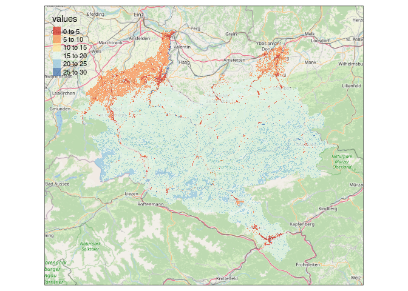
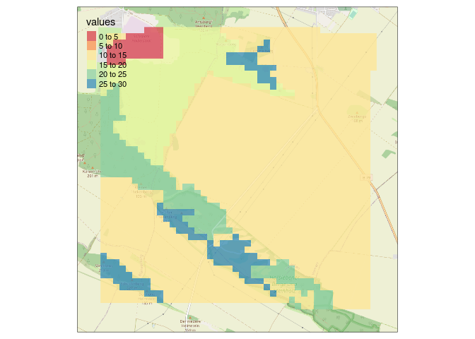
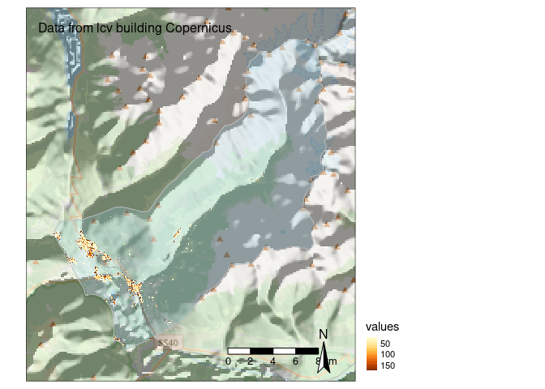

Demonstrating the Use of the `ReLTER` package for Earth Observation (EO)
================
Micha Silver and Alessandro Oggioni
1/02/2022

-   [Install and load packages](#install-and-load-packages)
-   [Query DEIMS SDR](#query-deims-sdr)
    -   [General metadata](#general-metadata)
-   [Spatial queries](#spatial-queries)
    -   [Get boundary of site](#get-boundary-of-site)
    -   [Save boundary as shapefile/geopackage for
        later](#save-boundary-as-shapefilegeopackage-for-later)
-   [Dependency on quality of data in DEIMS
    SDR](#dependency-on-quality-of-data-in-deims-sdr)
-   [Datasets from Open DataScience
    Europe](#datasets-from-open-datascience-europe)
    -   [High resolution landcover](#high-resolution-landcover)
    -   [Compare with Corine (lower resolution)
        Landcover](#compare-with-corine-lower-resolution-landcover)
    -   [NDVI during the spring](#ndvi-during-the-spring)
    -   [Small eLTER sites](#small-elter-sites)
    -   [Save to a Geotiff file for use in other GIS
        software](#save-to-a-geotiff-file-for-use-in-other-gis-software)
    -   [Copernicus building area in Saldur river catchment
        site](#copernicus-building-area-in-saldur-river-catchment-site)
-   [Datasets from MODIS](#datasets-from-modis)
    -   [What Products are available? What
        bands?](#what-products-are-available-what-bands)
    -   [Registering on EarthData
        website](#registering-on-earthdata-website)
    -   [Download a time series of MODIS NDVI for
        Eisenwurzen](#download-a-time-series-of-modis-ndvi-for-eisenwurzen)

This code demonstrates the use of the new `ReLTER` package. For more
details, see Allesando Oggioni’s [github
page](https://github.com/oggioniale/ReLTER)

Alessandro Oggioni, Micha Silver, Luigi Ranghetti & Paolo Tagliolato.
(2021). oggioniale/ReLTER: ReLTER v1.0.0 (1.0.0). Zenodo.
<https://doi.org/10.5281/zenodo.5576813>

# Install and load packages

Begin by installing packages and loading them.

``` r
# These packages are required
pkg_list <- c("remotes", "tmap", "tmaptools", "sf", "terra", "OpenStreetMap", "raster")

# Check if already installed, install if not
installed_packages <- pkg_list %in% rownames(installed.packages())
if (any(installed_packages == FALSE)) {
    install.packages(pkg_list[!installed_packages])
}
# Load Packages
lapply(pkg_list, function(p) {
    require(p, character.only = TRUE, quietly = TRUE)
})

# Now install `ReLTER` from github and load
remotes::install_github("oggioniale/ReLTER")
# If you want the development version, with latest functions:
# remotes::install_github('oggioniale/ReLTER@dev')
library(ReLTER)

# Choose where to save outputs
Output_dir = "./Output"
if (!dir.exists(Output_dir)) {
    dir.create(Output_dir)
}
```

# Query DEIMS SDR

The `ReLTER` package interfaces with the [DEIMS SDR](https://deims.org/)
database.

We can query the database in many ways: First retrieve the full URL to a
few eLTER sites. Sites can be selected by *country name*, *site name* or
both. Note that partial matching is also supported. So
`country_name = "Austri"` will find sites in Austria, but not Australia.

``` r
eisen <- get_ilter_generalinfo(country = "Austria", site_name = "LTSER Platform Eisen")
eisen_deimsid <- eisen$uri

# Using abbreviated 'United K' to differentiate from United States
cairngorms <- get_ilter_generalinfo(country = "United K", site_name = "Cairngorms National")
cairngorms_deimsid <- cairngorms$uri
```

### General metadata

In `ReLTER` there are functions to grab metadata for the sites. Metadata
is available for a few categories.

These categories are available:

-   ‘Affiliations’
-   ‘Boundaries’ (spatial layer)
-   ‘Contacts’
-   ‘EnvCharacts’ (environmental characteristics)
-   ‘General’,
-   ‘Infrastructure’
-   ‘Parameters’ (which parameters are collected)
-   ‘RelateRes’ (related research)
-   ‘ResearchTop’ (research topics)

Here are a few basic examples:

``` r
response <- get_site_info(eisen_deimsid, category = "ResearchTop")
response$researchTopics
```

    ## [[1]]
    ##              researchTopicsLabel                           researchTopicsUri
    ## 1                    agriculture http://vocabs.lter-europe.net/EnvThes/21605
    ## 2                  air chemistry http://vocabs.lter-europe.net/EnvThes/21657
    ## 3                 animal ecology    http://vocabs.lter-europe.net/EnvThes/71
    ## 4                    aquaculture http://vocabs.lter-europe.net/EnvThes/30003
    ## 5                   biodiversity http://vocabs.lter-europe.net/EnvThes/21673
    ## 6                biogeochemistry http://vocabs.lter-europe.net/EnvThes/21609
    ## 7                        biology http://vocabs.lter-europe.net/EnvThes/21611
    ## 8                 climate change http://vocabs.lter-europe.net/EnvThes/21754
    ## 9             climate monitoring http://vocabs.lter-europe.net/EnvThes/21757
    ## 10            community dynamics http://vocabs.lter-europe.net/EnvThes/21680
    ## 11                  conservation http://vocabs.lter-europe.net/EnvThes/21663
    ## 12                 ecophysiology http://vocabs.lter-europe.net/EnvThes/21652
    ## 13             ecosystem ecology http://vocabs.lter-europe.net/EnvThes/21689
    ## 14            ecosystem function http://vocabs.lter-europe.net/EnvThes/20519
    ## 15             ecosystem service http://vocabs.lter-europe.net/EnvThes/20520
    ## 16                forest ecology http://vocabs.lter-europe.net/EnvThes/21693
    ## 17                       geology http://vocabs.lter-europe.net/EnvThes/21740
    ## 18                     hydrology http://vocabs.lter-europe.net/EnvThes/21747
    ## 19                  lake ecology    http://vocabs.lter-europe.net/EnvThes/69
    ## 20              land use history http://vocabs.lter-europe.net/EnvThes/21744
    ## 21             landscape ecology http://vocabs.lter-europe.net/EnvThes/21703
    ## 22                     limnology http://vocabs.lter-europe.net/EnvThes/21749
    ## 23 long term ecological research http://vocabs.lter-europe.net/EnvThes/21751
    ## 24             microbial ecology    http://vocabs.lter-europe.net/EnvThes/77
    ## 25               natural science http://vocabs.lter-europe.net/EnvThes/30031
    ## 26                    physiology http://vocabs.lter-europe.net/EnvThes/21651
    ## 27                 plant ecology http://vocabs.lter-europe.net/EnvThes/21710
    ## 28              plant physiology http://vocabs.lter-europe.net/EnvThes/21653
    ## 29                  silviculture http://vocabs.lter-europe.net/EnvThes/21608
    ## 30               social sciences http://vocabs.lter-europe.net/EnvThes/30006
    ## 31                     sociology http://vocabs.lter-europe.net/EnvThes/30012
    ## 32                soil chemistry http://vocabs.lter-europe.net/EnvThes/21660
    ## 33             species diversity http://vocabs.lter-europe.net/EnvThes/21679
    ## 34                stream ecology    http://vocabs.lter-europe.net/EnvThes/72
    ## 35           terrestrial ecology    http://vocabs.lter-europe.net/EnvThes/79
    ## 36              trophic dynamics http://vocabs.lter-europe.net/EnvThes/21682
    ## 37           vegetation dynamics http://vocabs.lter-europe.net/EnvThes/21711

``` r
response <- get_site_info(cairngorms_deimsid, category = "Affiliations")
response$affiliation.projects
```

    ## [[1]]
    ##                                    label
    ## 1                            Natura 2000
    ## 2          Ramsar Convention on Wetlands
    ## 3                                 Teabag
    ## 4 Water Framework Directive (2000/60/EC)
    ## 5                          eLTER (H2020)
    ## 6                        eLTER catalogue
    ##                                                                    uri
    ## 1                                                                 <NA>
    ## 2                                               https://www.ramsar.org
    ## 3                                                                 <NA>
    ## 4 https://ec.europa.eu/environment/water/water-framework/index_en.html
    ## 5                           https://cordis.europa.eu/project/id/654359
    ## 6                                                                 <NA>

# Spatial queries

Now use the DEIMS ID, acquired above, to get the boundary of a site, by
setting `category = "Boundaries"`.

### Get boundary of site

``` r
# Acquire boundary for site
eisen_boundary <- get_site_info(eisen_deimsid, "Boundaries")

# Prepare OSM background tile and plot
osm <- read_osm(eisen_boundary, ext = 1.2)
tmap_mode("plot")
```

    ## tmap mode set to plotting

``` r
# For interactive maps use: tmap_mode('view') Then these basemaps are
# available: tm_basemap('Stamen.TerrainBackground') +
# tm_basemap('OpenStreetMap') +

tm_shape(osm) + tm_rgb() + tm_shape(eisen_boundary) + tm_polygons(col = "skyblue",
    alpha = 0.25, border.col = "blue")
```

<!-- -->

### Save boundary as shapefile/geopackage for later

The code below saves the boundary to a file for use in other GIS
software.

``` r
# Edit here to choose your output directory
boundary_file <- file.path(Output_dir, "eisen_boundary.gpkg")

# Remove country column since it is a list (Some sites extend across country
# boundaries)
eisen_boundary <- subset(eisen_boundary, select = -country)
st_write(eisen_boundary, dsn = boundary_file, append = FALSE)
```

    ## Deleting layer `eisen_boundary' using driver `GPKG'
    ## Writing layer `eisen_boundary' to data source 
    ##   `./Output/eisen_boundary.gpkg' using driver `GPKG'
    ## Writing 1 features with 7 fields and geometry type Polygon.

# Dependency on quality of data in DEIMS SDR

`ReLTER` relies on the DEIMS SDR database for all site queries.
Therefore, any errors or missing data will obviously be echoed in the
`ReLTER` results. These errors include:

-   Missing information
-   Duplicate names
-   Missing boundary shapefile

Here are a few examples:

``` r
eisen_contact <- get_site_info(eisen_deimsid, "Contact")
names(eisen_contact)
## [1] "title"        "uri"          "geoCoord"     "country"      "geoElev.avg" 
## [6] "geoElev.min"  "geoElev.max"  "geoElev.unit"
# No contact information :-(

kiskun <- get_ilter_generalinfo(country_name = "Hungary", site_name = "KISKUN LTER")
kiskun_deimsid <- kiskun$uri
length(kiskun_deimsid)
## [1] 8
# Multiple sites with similar name :-( Which to choose? View the list...
kiskun$title
## [1] "Kiskun Forest Reserve Sites, KISKUN LTER - Hungary"   
## [2] "VULCAN Kiskunsag, KISKUN LTER - Hungary"              
## [3] "Kiskun Restoration Experiments, KISKUN LTER - Hungary"
## [4] "Kiskun Site Network (Jedlik), KISKUN LTER - Hungary"  
## [5] "KISKUN LTER - Hungary"                                
## [6] "LTER Fulophaza Site, KISKUN LTER - Hungary"           
## [7] "Bugac-Bocsa-Orgovany Site, KISKUN LTER - Hungary"     
## [8] "Orgovany Site, KISKUN LTER - Hungary"
kiskun_deimsid <- kiskun$uri[5]
length(kiskun_deimsid)
## [1] 1
kiskun_boundary <- get_site_info(kiskun_deimsid, "Boundaries")
## 
## ----
## This site does not have boundaries uploaded to DEIMS-SDR.
## Please verify in the site page: https://deims.org/124f227a-787d-4378-bc29-aa94f29e1732
## ----

# Oops, no boundary for this site!
```

# Datasets from Open DataScience Europe

The recent efforts by the
[Geoharmonizer](https://opendatascience.eu/geoharmonizer-project/)
program have resulted in a consolidated set of freely available raster
data (gridded) datasets. All rasters are formatted as Cloud Optimzed
Geotiff (COG). These can be viewed on the [ODS web
portal](https://maps.opendatascience.eu/).

The code below demonstrates how to access various data from ODS from
within *R*, and to clip to site boundaries. The datasets currently
implemented are:

-   “landcover” (Landcover at 30 meter resolution from Landsat)
-   “clc2018” (Corine landcover from 2018)
-   “osm\_buildings” (Open Street Maps buildings)
-   “natura2000”
-   “ndvi\_spring”
-   “ndvi\_summer”
-   “ndvi\_autumn”
-   “ndvi\_winter”

### High resolution landcover

``` r
# Use boundary and OSM tile from above
eisen_landcover <- get_site_ODS(eisen_deimsid, "landcover")

tm_shape(osm) + tm_rgb() + tm_shape(eisen_landcover) + tm_raster(style = "pretty",
    palette = "RdYlBu", alpha = 0.75)
```

    ## stars object downsampled to 1089 by 918 cells. See tm_shape manual (argument raster.downsample)

<!-- -->

### Compare with Corine (lower resolution) Landcover

``` r
eisen_corine <- get_site_ODS(eisen_deimsid, "clc2018")

tm_shape(osm) + tm_rgb() + tm_shape(eisen_corine) + tm_raster(style = "pretty", palette = "Spectral",
    alpha = 0.75)
```

    ## stars object downsampled to 1089 by 918 cells. See tm_shape manual (argument raster.downsample)

<!-- -->

### NDVI during the spring

The COG format converts raster data to integer.

``` r
# Takes several minutes
eisen_ndvi <- get_site_ODS(eisen_deimsid, "ndvi_spring")
tm_shape(osm) + tm_rgb() + tm_shape(eisen_ndvi) + tm_raster(style = "pretty", palette = "RdYlGn",
    alpha = 0.75)
```

    ## stars object downsampled to 1089 by 918 cells. See tm_shape manual (argument raster.downsample)

<!-- -->

### Small eLTER sites

ODS data layers are at 30 meter resolution, suitable for small sites.
This code examines the Tereno site at Harsleben.

``` r
# Acquire Tereno DEIMS ID and boundary
tereno <- get_ilter_generalinfo(country_name = "Germany", site_name = "Tereno - Harsleben")
tereno_deimsid <- tereno$uri
tereno_boundary <- get_site_info(tereno_deimsid, "Boundaries")

# Prepare new OSM background and plot
osm <- read_osm(tereno_boundary, ext = 1.2)
tereno_ndvi <- get_site_ODS(tereno_deimsid, "ndvi_autumn")
tm_shape(osm) + tm_rgb() + tm_shape(tereno_ndvi) + tm_raster(style = "pretty", palette = "RdYlGn",
    alpha = 0.75)
```

<!-- -->

Again compare Landsat based landcover (30 m.) with Corine 2018 (100 m.)

``` r
tereno_landcover <- get_site_ODS(tereno_deimsid, "landcover")
tm_shape(osm) + tm_rgb() + tm_shape(tereno_landcover) + tm_raster(style = "pretty",
    palette = "Spectral", alpha = 0.75)
```

<!-- -->

``` r
tereno_corine <- get_site_ODS(tereno_deimsid, "clc2018")
tm_shape(osm) + tm_rgb() + tm_shape(tereno_corine) + tm_raster(style = "pretty",
    palette = "Spectral", alpha = 0.75)
```

<!-- -->

### Save to a Geotiff file for use in other GIS software

``` r
# Edit here to choose your output directory
landcover_file <- file.path(Output_dir, "tereno_landcover.tif")
writeRaster(tereno_landcover, landcover_file, overwrite = TRUE)
```

### Copernicus building area in Saldur river catchment site

This code chunk shows how to acquire OpenStreetMap building footprints
from the ODS datasets. OSM building footprints are available by setting
the `dataset` option to “osm\_buildings”. Here is an example for the
Saldur river basin in Italy.

``` r
saldur <- get_ilter_generalinfo(country = "Italy", site_name = "Saldur River Catchment")
saldur_deimsid <- saldur$uri
saldurRiver_osmLandUse <- get_site_ODS(deimsid = saldur_deimsid, dataset = "osm_buildings")
saldur_boundary <- get_site_info(deimsid = saldur_deimsid, "Boundaries")
# Prepare OSM background tile and plot
osm <- read_osm(saldur_boundary, ext = 1.2)
# Hillshade of Saldur river bounding box
saldur_hs <- raster::raster("ReLTER_demo_files/saldur_hillshade.tif")

tm_shape(osm) + tm_rgb() + tm_compass(type = "arrow", position = c("right", "bottom"),
    text.size = 1) + tm_scale_bar(position = c(0.6, "bottom"), text.size = 0.8) +
    tm_credits("Data from lcv building Copernicus", position = c("left", "top"),
        size = 1) + tm_layout(legend.position = c("left", "bottom")) + tm_shape(saldur_hs) +
    tm_raster(palette = "-Greys", style = "cont", legend.show = FALSE, alpha = 0.4) +
    tm_shape(saldur_boundary) + tm_polygons(col = "skyblue", alpha = 0.2, border.col = "gray") +
    tm_shape(saldurRiver_osmLandUse) + tm_raster(style = "cont") + tm_layout(legend.outside = TRUE)
```

<!-- -->

# Datasets from MODIS

This capability of `ReLTER` relies on another package `MODIStsp` L.
Busetto, L. Ranghetti (2016) *MODIStsp: An R package for automatic
preprocessing of MODIS Land Products time series*, Computers &
Geosciences, Volume 97, Pages 40-48, ISSN 0098-3004,
<https://doi.org/10.1016/j.cageo.2016.08.020>. URL
<https://github.com/ropensci/MODIStsp/>.

### What Products are available? What bands?

``` r
source("~/work/EU_Projects/ReLTER/R/get_site_MODIS.R")
get_site_MODIS(show_products = TRUE)
```

    ##   [1] "Surf_Ref_8Days_500m (M*D09A1)"                   
    ##   [2] "Surf_Ref_Daily_005dg (M*D09CMG)"                 
    ##   [3] "Surf_Ref_Daily_500m (M*D09GA)"                   
    ##   [4] "Surf_Ref_Daily_250m (M*D09GQ)"                   
    ##   [5] "Surf_Ref_8Days_250m (M*D09Q1)"                   
    ##   [6] "Ocean_Ref_Daily_1Km (M*DOCGA)"                   
    ##   [7] "Therm_Daily_1Km (M*DTBGA)"                       
    ##   [8] "Snow_Cov_Daily_500m (M*D10A1)"                   
    ##   [9] "Snow_Cov_8-Day_500m (M*D10_A2)"                  
    ##  [10] "Snow_Cov_Day_0.05Deg (M*D10C1)"                  
    ##  [11] "Snow_Cov_8-Day0.05Deg CMG (M*D10C2)"             
    ##  [12] "Snow_Cov_Month_0.05Deg CMG (M*D10CM)"            
    ##  [13] "Surf_Temp_Daily_005dg (M*D11C1)"                 
    ##  [14] "Surf_Temp_Daily_1Km (M*D11A1)"                   
    ##  [15] "Surf_Temp_8Days_1Km (M*D11A2)"                   
    ##  [16] "Surf_Temp_Daily_GridSin (M*D11B1)"               
    ##  [17] "Surf_Temp_8Days_GridSin (M*D11B2)"               
    ##  [18] "Surf_Temp_Monthly_GridSin (M*D11B3)"             
    ##  [19] "Surf_Temp_8Days_005dg (M*D11C2)"                 
    ##  [20] "Surf_Temp_Monthly_005dg (M*D11C3)"               
    ##  [21] "LST_3band_emissivity_Daily_1km (M*D21A1D)"       
    ##  [22] "LST_3band_emissivity_Daily_1km_night (M*D21A1N)" 
    ##  [23] "LST_3band_emissivity_8day_1km (M*D21A2)"         
    ##  [24] "BRDF_Albedo_ModelPar_Daily_500m (MCD43A1)"       
    ##  [25] "BRDF_Albedo_Quality_Daily_500m (MCD43A2)"        
    ##  [26] "Albedo_Daily_500m (MCD43A3)"                     
    ##  [27] "BRDF_Adj_Refl_Daily_500m (MCD43A4)"              
    ##  [28] "BRDF_Albedo_ModelPar_Daily_005dg (MCD43C1)"      
    ##  [29] "BRDF_Albedo_Quality_Daily_005dg (MCD43C2)"       
    ##  [30] "Albedo_Daily_005dg (MCD43C3)"                    
    ##  [31] "BRDF_Adj_Refl_16Day_005dg (MCD43C4)"             
    ##  [32] "AlbPar_1_B1_Daily_30ArcSec (MCD43D01)"           
    ##  [33] "AlbPar_2_B1_Daily_30ArcSec (MCD43D02)"           
    ##  [34] "AlbPar_3_B1_Daily_30ArcSec (MCD43D03)"           
    ##  [35] "AlbPar_1_B2_Daily_30ArcSec (MCD43D04)"           
    ##  [36] "AlbPar_2_B2_Daily_30ArcSec (MCD43D05)"           
    ##  [37] "AlbPar_3_B2_Daily_30ArcSec (MCD43D06)"           
    ##  [38] "AlbPar_1_B3_Daily_30ArcSec (MCD43D07)"           
    ##  [39] "AlbPar_2_B3_Daily_30ArcSec (MCD43D08)"           
    ##  [40] "AlbPar_3_B3_Daily_30ArcSec (MCD43D09)"           
    ##  [41] "AlbPar_1_B4_Daily_30ArcSec (MCD43D10)"           
    ##  [42] "AlbPar_2_B4_Daily_30ArcSec (MCD43D11)"           
    ##  [43] "AlbPar_3_B4_Daily_30ArcSec (MCD43D12)"           
    ##  [44] "AlbPar_1_B4_Daily_30ArcSec (MCD43D13)"           
    ##  [45] "AlbPar_2_B4_Daily_30ArcSec (MCD43D14)"           
    ##  [46] "AlbPar_3_B4_Daily_30ArcSec (MCD43D15)"           
    ##  [47] "AlbPar_1_B5_Daily_30ArcSec (MCD43D16)"           
    ##  [48] "AlbPar_2_B5_Daily_30ArcSec (MCD43D17)"           
    ##  [49] "AlbPar_3_B5_Daily_30ArcSec (MCD43D18)"           
    ##  [50] "AlbPar_1_B6_Daily_30ArcSec (MCD43D19)"           
    ##  [51] "AlbPar_2_B6_Daily_30ArcSec (MCD43D20)"           
    ##  [52] "AlbPar_3_B6_Daily_30ArcSec (MCD43D21)"           
    ##  [53] "AlbPar_1_Vis_Daily_30ArcSec (MCD43D22)"          
    ##  [54] "AlbPar_2_Vis_Daily_30ArcSec (MCD43D23)"          
    ##  [55] "AlbPar_3_Vis_Daily_30ArcSec (MCD43D24)"          
    ##  [56] "AlbPar_1_NIR_Daily_30ArcSec (MCD43D25)"          
    ##  [57] "AlbPar_2_NIR_Daily_30ArcSec (MCD43D26)"          
    ##  [58] "AlbPar_3_NIR_Daily_30ArcSec (MCD43D27)"          
    ##  [59] "AlbPar_1_SWIR_Daily_30ArcSec (MCD43D28)"         
    ##  [60] "AlbPar_2_SWIR_Daily_30ArcSec (MCD43D29)"         
    ##  [61] "AlbPar_3_SWIR_Daily_30ArcSec (MCD43D30)"         
    ##  [62] "BRDF_Albedo_Quality_Daily_30ArcSec (MCD43D31)"   
    ##  [63] "BRDF_Albedo_SolNoon_Daily_30ArcSec (MCD43D32)"   
    ##  [64] "Alb_ValObs_B1_Daily_30ArcSec (MCD43D33)"         
    ##  [65] "Alb_ValObs_B2_Daily_30ArcSec (MCD43D34)"         
    ##  [66] "Alb_ValObs_B3_Daily_30ArcSec (MCD43D35)"         
    ##  [67] "Alb_ValObs_B4_Daily_30ArcSec (MCD43D36)"         
    ##  [68] "Alb_ValObs_B5_Daily_30ArcSec (MCD43D37)"         
    ##  [69] "Alb_ValObs_B6_Daily_30ArcSec (MCD43D38)"         
    ##  [70] "Alb_ValObs_B7_Daily_30ArcSec (MCD43D39)"         
    ##  [71] "BRDF_Albedo_Snow_Daily_30ArcSec (MCD43D40)"      
    ##  [72] "BRDF_Alb_Unc_Daily_30ArcSec (MCD43D41)"          
    ##  [73] "BRDF_Alb_BSA_B1_Daily_30ArcSec (MCD43D42)"       
    ##  [74] "BRDF_Alb_BSA_B2_Daily_30ArcSec (MCD43D43)"       
    ##  [75] "BRDF_Alb_BSA_B3_Daily_30ArcSec (MCD43D44)"       
    ##  [76] "BRDF_Alb_BSA_B4_Daily_30ArcSec (MCD43D45)"       
    ##  [77] "BRDF_Alb_BSA_B5_Daily_30ArcSec (MCD43D46)"       
    ##  [78] "BRDF_Alb_BSA_B6_Daily_30ArcSec (MCD43D47)"       
    ##  [79] "BRDF_Alb_BSA_B7_Daily_30ArcSec (MCD43D48)"       
    ##  [80] "BRDF_Alb_BSA_Vis_Daily_30ArcSec (MCD43D49)"      
    ##  [81] "BRDF_Alb_BSA_NIR_Daily_30ArcSec (MCD43D50)"      
    ##  [82] "BRDF_Alb_BSA_SWIR_Daily_30ArcSec (MCD43D51)"     
    ##  [83] "BRDF_Alb_WSA_B1_Daily_30ArcSec (MCD43D52)"       
    ##  [84] "BRDF_Alb_WSA_B2_Daily_30ArcSec (MCD43D53)"       
    ##  [85] "BRDF_Alb_WSA_B3_Daily_30ArcSec (MCD43D54)"       
    ##  [86] "BRDF_Alb_WSA_B4_Daily_30ArcSec (MCD43D55)"       
    ##  [87] "BRDF_Alb_WSA_B5_Daily_30ArcSec (MCD43D56)"       
    ##  [88] "BRDF_Alb_WSA_B6_Daily_30ArcSec (MCD43D57)"       
    ##  [89] "BRDF_Alb_WSA_B7_Daily_30ArcSec (MCD43D58)"       
    ##  [90] "BRDF_Alb_WSA_Vis_Daily_30ArcSec (MCD43D59)"      
    ##  [91] "BRDF_Alb_WSA_NIR_Daily_30ArcSec (MCD43D60)"      
    ##  [92] "BRDF_Alb_WSA_SWIR_Daily_30ArcSec (MCD43D61)"     
    ##  [93] "BRDF_Albedo_NBAR_Band1_Daily_30ArcSec (MCD43D62)"
    ##  [94] "BRDF_Albedo_NBAR_Band2_Daily_30ArcSec (MCD43D63)"
    ##  [95] "BRDF_Albedo_NBAR_Band3_Daily_30ArcSec (MCD43D64)"
    ##  [96] "BRDF_Albedo_NBAR_Band4_Daily_30ArcSec (MCD43D65)"
    ##  [97] "BRDF_Albedo_NBAR_Band5_Daily_30ArcSec (MCD43D66)"
    ##  [98] "BRDF_Albedo_NBAR_Band6_Daily_30ArcSec (MCD43D67)"
    ##  [99] "BRDF_Albedo_NBAR_Band7_Daily_30ArcSec (MCD43D68)"
    ## [100] "Vegetation_Indexes_16Days_500m (M*D13A1)"        
    ## [101] "Vegetation_Indexes_16Days_1Km (M*D13A2)"         
    ## [102] "Vegetation_Indexes_Monthly_1Km (M*D13A3)"        
    ## [103] "Vegetation_Indexes_16Days_005dg (M*D13C1)"       
    ## [104] "Vegetation_Indexes_Monthly_005dg (M*D13C2)"      
    ## [105] "Vegetation Indexes_16Days_250m (M*D13Q1)"        
    ## [106] "LAI_8Days_500m (MCD15A2H)"                       
    ## [107] "LAI_4Days_500m (MCD15A3H)"                       
    ## [108] "LAI_8Days_500m (M*D15A2H)"                       
    ## [109] "Net_ET_8Day_500m (M*D16A2)"                      
    ## [110] "Net_ETgf_8Day_500m (M*D16A2GF)"                  
    ## [111] "Net_ETgf_Yearly_500m (M*D16A3GF)"                
    ## [112] "Gross_PP_8Days_500m (M*D17A2H)"                  
    ## [113] "Gross_PP_GapFil_8Days_500m (M*D17A2HGF)"         
    ## [114] "Net_PP_GapFil_Yearly_500m (M*D17A3HGF)"          
    ## [115] "Veg_Cont_Fields_Yearly_250m (MOD44B)"            
    ## [116] "Land_Wat_Mask_Yearly_250m (MOD44W)"              
    ## [117] "Burned_Monthly_500m (MCD64A1)"                   
    ## [118] "ThermalAn_Fire_Daily_1Km (M*D14A1)"              
    ## [119] "ThermalAn_Fire_8Days_1Km (M*D14A2)"              
    ## [120] "LandCover_Type_Yearly_005dg (MCD12C1)"           
    ## [121] "LandCover_Type_Yearly_500m (MCD12Q1)"            
    ## [122] "LandCover_Dynamics_Yearly_500m (MCD12Q2)"        
    ## [123] "Dwnwrd_Srw_Rad_3h_005dg (MCD18A1)"               
    ## [124] "Dwnwrd_PAR_3h_005dg (MCD18A2)"                   
    ## [125] "MAIA_Land_Surf_BRF (MCD19A1)"                    
    ## [126] "MAIA_Land_AOT_daily (MCD19A2)"

    ## NULL

``` r
get_site_MODIS(show_bands = "Vegetation_Indexes_Monthly_1Km (M*D13A3)")
```

    ##  [1] "NDVI"     "EVI"      "VI_QA"    "b1_Red"   "b2_NIR"   "b3_Blue" 
    ##  [7] "b7_SWIR"  "View_Zen" "Sun_Zen"  "Rel_Az"   "Rely"

    ## NULL

### Registering on EarthData website

To acquire MODIS data you must be registered at:
<https://urs.earthdata.nasa.gov/> Then use your earthdata username and
password in the code below

``` r
# Username and password saved in advance For example:

# creds <- list('username'='homer', password='Simpsons') saveRDS(creds,
# 'earthdata_credentials.rds)

# Then...
creds <- readRDS("earthdata_credentials.rds")
```

### Download a time series of MODIS NDVI for Eisenwurzen

``` r
# Set which product and which bands to get
product = "Vegetation_Indexes_Monthly_1Km (M*D13A3)"
bands = "NDVI"    # Also EVI is available

eisen_ndvi <- get_site_MODIS(eisen_deimsid,               # Which site
                          earthdata_user = creds$username, # From above
                          earthdata_passwd = creds$password,
                          product = product,
                          bands = bands,
                          from_date = "2020.01.01", 
                          to_date =  "2020.12.31",        # From-To dates
                          scale = TRUE,          # Rescale COG back to real values
                          out_folder = Output_dir,        # Where to save outputs
                          save_ts_dir = Output_dir
                          )

# Plot was saved to:
plot_file <- paste("time_series", paste(bands, collapse="_"), sep="_")
plot_path <- file.path(Output_dir, paste0(plot_file, ".png"))
knitr::include_graphics(plot_path)
```


