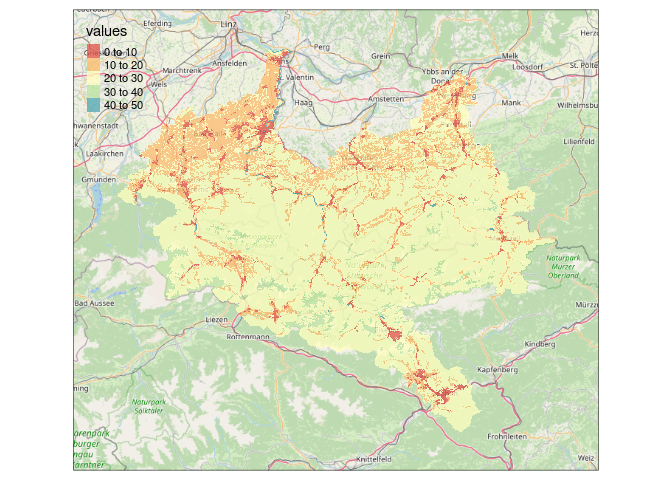
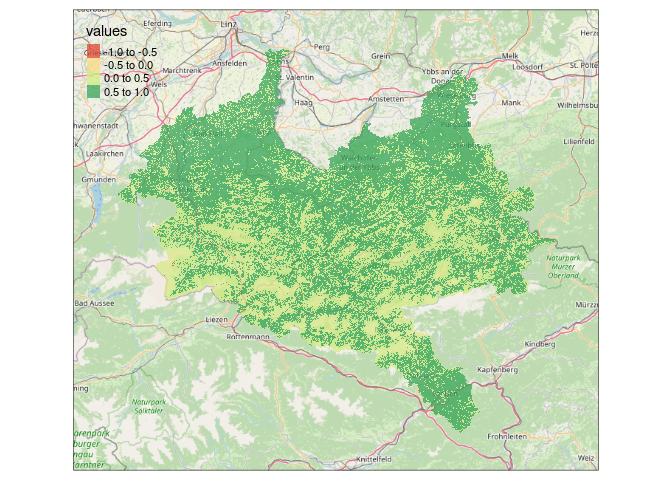

Demonstrating the Use of the `ReLTER` package
================
Micha Silver
29/12/2021

-   [Install and load packages](#install-and-load-packages)
-   [Query DEIMS SDR](#query-deims-sdr)
-   [General metadata](#general-metadata)
-   [Spatial queries](#spatial-queries)
    -   [Get boundary of site](#get-boundary-of-site)
    -   [Save boundary as shapefile/geopackage for
        later](#save-boundary-as-shapefilegeopackage-for-later)
-   [Dependency on quality of data in DEIMS
    SDR](#dependency-on-quality-of-data-in-deims-sdr)
-   [Datasets from Open DataScience
    Europe](#datasets-from-open-datascience-europe)
    -   [High resolution landcover](#high-resolution-landcover)
    -   [Compare with Corine (lower resolution)
        Landcover](#compare-with-corine-lower-resolution-landcover)
    -   [NDVI during the spring](#ndvi-during-the-spring)
    -   [Small eLTER sites](#small-elter-sites)
    -   [Save to a Geotiff file for use in other GIS
        software](#save-to-a-geotiff-file-for-use-in-other-gis-software)

This code demonstrates the use of the new `ReLTER` package. [Allesando
Oggioni’s github page](https://github.com/oggioniale/ReLTER)

Alessandro Oggioni, Micha Silver, Luigi Ranghetti & Paolo Tagliolato.
(2021). oggioniale/ReLTER: ReLTER v1.0.0 (1.0.0). Zenodo.
<https://doi.org/10.5281/zenodo.5576813>

## Install and load packages

Begin by installing packages and loading them.

``` r
# These packages are required
pkg_list <- c("remotes", "tmap", "tmaptools", "sf", "terra", "OpenStreetMap")

# Check if already installed, install if not
installed_packages <- pkg_list %in% rownames(installed.packages())
if (any(installed_packages == FALSE)) {
    install.packages(pkg_list[!installed_packages])
}
# Load Packages
lapply(pkg_list, function(p) {
    require(p, character.only = TRUE, quietly = TRUE)
})

# Now install `ReLTER` from github and load
remotes::install_github("oggioniale/ReLTER")
library(ReLTER)
```

## Query DEIMS SDR

The `ReLTER` package interfaces with the [DEIMS SDR](https://deims.org/)
database.

We can query the database in many ways: First retrieve the full URL to a
few eLTER sites. Sites can be selected by *country name*, *site name* or
both. Note that partial matching is also supported. So
`country_name = "Austri"` will find sites in Austria, but not Australia.

``` r
eisen <- get_ilter_generalinfo(country = "Austria", site_name = "Eisen")
eisen_deimsid <- eisen$uri

# Using abbreviated 'United K' to differentiate from United States
cairngorms <- get_ilter_generalinfo(country = "United K", site_name = "Cairngorms National")
cairngorms_deimsid <- cairngorms$uri
```

## General metadata

In `ReLTER` there are functions to grab metadata for the sites. Metadata
is available for a few categories.

These categories are available:

-   ‘Affiliations’
-   ‘Boundaries’ (spatial layer)
-   ‘Contacts’
-   ‘EnvCharacts’ (environmental characteristics)
-   ‘General’,
-   ‘Infrastructure’
-   ‘Parameters’ (which parameters are collected)
-   ‘RelateRes’ (related research)
-   ‘ResearchTop’ (research topics)

Here are a few basic examples:

``` r
response <- get_site_info(eisen_deimsid, category = "ResearchTop")
response$researchTopics
```

    ## [[1]]
    ##              researchTopicsLabel                           researchTopicsUri
    ## 1                    agriculture http://vocabs.lter-europe.net/EnvThes/21605
    ## 2                  air chemistry http://vocabs.lter-europe.net/EnvThes/21657
    ## 3                 animal ecology    http://vocabs.lter-europe.net/EnvThes/71
    ## 4                    aquaculture http://vocabs.lter-europe.net/EnvThes/30003
    ## 5                   biodiversity http://vocabs.lter-europe.net/EnvThes/21673
    ## 6                biogeochemistry http://vocabs.lter-europe.net/EnvThes/21609
    ## 7                        biology http://vocabs.lter-europe.net/EnvThes/21611
    ## 8                 climate change http://vocabs.lter-europe.net/EnvThes/21754
    ## 9             climate monitoring http://vocabs.lter-europe.net/EnvThes/21757
    ## 10            community dynamics http://vocabs.lter-europe.net/EnvThes/21680
    ## 11                  conservation http://vocabs.lter-europe.net/EnvThes/21663
    ## 12                 ecophysiology http://vocabs.lter-europe.net/EnvThes/21652
    ## 13             ecosystem ecology http://vocabs.lter-europe.net/EnvThes/21689
    ## 14            ecosystem function http://vocabs.lter-europe.net/EnvThes/20519
    ## 15             ecosystem service http://vocabs.lter-europe.net/EnvThes/20520
    ## 16                forest ecology http://vocabs.lter-europe.net/EnvThes/21693
    ## 17                       geology http://vocabs.lter-europe.net/EnvThes/21740
    ## 18                     hydrology http://vocabs.lter-europe.net/EnvThes/21747
    ## 19                  lake ecology    http://vocabs.lter-europe.net/EnvThes/69
    ## 20              land use history http://vocabs.lter-europe.net/EnvThes/21744
    ## 21             landscape ecology http://vocabs.lter-europe.net/EnvThes/21703
    ## 22                     limnology http://vocabs.lter-europe.net/EnvThes/21749
    ## 23 long term ecological research http://vocabs.lter-europe.net/EnvThes/21751
    ## 24             microbial ecology    http://vocabs.lter-europe.net/EnvThes/77
    ## 25               natural science http://vocabs.lter-europe.net/EnvThes/30031
    ## 26                    physiology http://vocabs.lter-europe.net/EnvThes/21651
    ## 27                 plant ecology http://vocabs.lter-europe.net/EnvThes/21710
    ## 28              plant physiology http://vocabs.lter-europe.net/EnvThes/21653
    ## 29                  silviculture http://vocabs.lter-europe.net/EnvThes/21608
    ## 30               social sciences http://vocabs.lter-europe.net/EnvThes/30006
    ## 31                     sociology http://vocabs.lter-europe.net/EnvThes/30012
    ## 32                soil chemistry http://vocabs.lter-europe.net/EnvThes/21660
    ## 33             species diversity http://vocabs.lter-europe.net/EnvThes/21679
    ## 34                stream ecology    http://vocabs.lter-europe.net/EnvThes/72
    ## 35           terrestrial ecology    http://vocabs.lter-europe.net/EnvThes/79
    ## 36              trophic dynamics http://vocabs.lter-europe.net/EnvThes/21682
    ## 37           vegetation dynamics http://vocabs.lter-europe.net/EnvThes/21711

``` r
response <- get_site_info(cairngorms_deimsid, category = "Affiliations")
response$affiliation.projects
```

    ## [[1]]
    ##                                    label
    ## 1                            Natura 2000
    ## 2          Ramsar Convention on Wetlands
    ## 3                                 Teabag
    ## 4 Water Framework Directive (2000/60/EC)
    ## 5                          eLTER (H2020)
    ## 6                        eLTER catalogue
    ##                                                                    uri
    ## 1                                                                 <NA>
    ## 2                                               https://www.ramsar.org
    ## 3                                                                 <NA>
    ## 4 https://ec.europa.eu/environment/water/water-framework/index_en.html
    ## 5                           https://cordis.europa.eu/project/id/654359
    ## 6                                                                 <NA>

## Spatial queries

Now use the DEIMS ID, acquired above, to get the boundary of a site, by
setting `category = "Boundaries"`.

### Get boundary of site

``` r
# Acquire boundary for site
eisen_boundary <- get_site_info(eisen_deimsid, "Boundaries")

# Prepare OSM background tile and plot
osm <- read_osm(eisen_boundary, ext = 1.2)
tmap_mode("plot")
```

    ## tmap mode set to plotting

``` r
# tm_basemap('Stamen.TerrainBackground') + tm_basemap('OpenStreetMap') +
tm_shape(osm) + tm_rgb() + tm_shape(eisen_boundary) + tm_polygons(col = "skyblue",
    alpha = 0.25, border.col = "blue")
```

<!-- -->

### Save boundary as shapefile/geopackage for later

The code below saves the boundary to a file for use in other GIS
software.

``` r
# Edit here to choose your output directory
boundary_file <- file.path("~", "eisen_boundary.gpkg")

# Remove country column since it is a list
eisen_boundary <- subset(eisen_boundary, select = -country)
st_write(eisen_boundary, dsn = boundary_file, append = FALSE)
```

## Dependency on quality of data in DEIMS SDR

`ReLTER` relies on the DEIMS SDR database for all site queries.
Therefore, any errors or missing data will obviously be echoed in the
`ReLTER` results. These errors include:

-   Missing information
-   Duplicate names
-   Missing boundary shapefile

Here are a few examples:

``` r
eisen_contact <- get_site_info(eisen_deimsid, "Contact")
names(eisen_contact)
## [1] "title"        "uri"          "geoCoord"     "country"      "geoElev.avg" 
## [6] "geoElev.min"  "geoElev.max"  "geoElev.unit"
# No contact information :-(

kiskun <- get_ilter_generalinfo(country_name = "Hungary", site_name = "KISKUN LTER")
kiskun_deimsid <- kiskun$uri
length(kiskun_deimsid)
## [1] 8
# Multiple sites with similar name :-( Which to choose? View the list...
kiskun$title
## [1] "Kiskun Forest Reserve Sites, KISKUN LTER - Hungary"   
## [2] "VULCAN Kiskunsag, KISKUN LTER - Hungary"              
## [3] "Kiskun Restoration Experiments, KISKUN LTER - Hungary"
## [4] "Kiskun Site Network (Jedlik), KISKUN LTER - Hungary"  
## [5] "KISKUN LTER - Hungary"                                
## [6] "LTER Fulophaza Site, KISKUN LTER - Hungary"           
## [7] "Bugac-Bocsa-Orgovany Site, KISKUN LTER - Hungary"     
## [8] "Orgovany Site, KISKUN LTER - Hungary"
kiskun_deimsid <- kiskun$uri[5]
length(kiskun_deimsid)
## [1] 1
kiskun_boundary <- get_site_info(kiskun_deimsid, "Boundaries")
## 
## ----
## This site does not have boundaries uploaded to DEIMS-SDR.
## Please verify in the site page: https://deims.org/124f227a-787d-4378-bc29-aa94f29e1732
## ----

# Oops, no boundary for this site!
```

## Datasets from Open DataScience Europe

The recent efforts by the
[Geoharmonizer](https://opendatascience.eu/geoharmonizer-project/)
program have resulted in a consolidated set of freely available raster
data (gridded) datasets. All rasters are formatted as Cloud Optimzed
Geotiff (COG). These can be viewed on the [ODS web
portal](https://maps.opendatascience.eu/).

The code below demonstrates how to access various data from ODS, and to
clip to site boundaries. The datasets currently implemented are:

-   “landcover” (Landcover at 30 meter resolution from Landsat)
-   “clc2018” (Corine landcover from 2018)
-   “osm\_buildings” (Open Street Maps buildings)
-   “natura2000”
-   “ndvi\_spring”
-   “ndvi\_summer”
-   “ndvi\_autumn”
-   “ndvi\_winter”

### High resolution landcover

``` r
# Use boundary and OSM tile from above
eisen_landcover <- get_site_ODS(eisen_deimsid, "landcover")
tmap_mode("plot")
```

    ## tmap mode set to plotting

``` r
# tmap_mode('view') tm_basemap('Stamen.TerrainBackground') +
# tm_basemap('OpenStreetMap') +
tm_shape(osm) + tm_rgb() + tm_shape(eisen_landcover) + tm_raster(style = "pretty",
    palette = "RdYlBu", alpha = 0.75)
```

    ## stars object downsampled to 1089 by 918 cells. See tm_shape manual (argument raster.downsample)

<!-- -->

### Compare with Corine (lower resolution) Landcover

``` r
eisen_corine <- get_site_ODS(eisen_deimsid, "clc2018")
tm_shape(osm) + tm_rgb() + tm_shape(eisen_corine) + tm_raster(style = "pretty", palette = "Spectral",
    alpha = 0.75)
```

    ## stars object downsampled to 1089 by 918 cells. See tm_shape manual (argument raster.downsample)

<!-- -->

### NDVI during the spring

The COG format converts raster data to integer. To restore normal NDVI
values, divide raster by

``` r
eisen_ndvi <- get_site_ODS(eisen_deimsid, "ndvi_spring")
tm_shape(osm) + tm_rgb() + tm_shape(eisen_ndvi) + tm_raster(style = "pretty", palette = "RdYlGn",
    alpha = 0.75)
```

    ## stars object downsampled to 1089 by 918 cells. See tm_shape manual (argument raster.downsample)

<!-- -->

### Small eLTER sites

ODS data layers are at 30 meter resolution, suitable for small sites.
This code examines the Teneno site at Harsleben.

``` r
# Acquire Tereno ID and boundary
tereno <- get_ilter_generalinfo(country_name = "Germany", site_name = "Tereno - Harsleben")
tereno_deimsid <- tereno$uri
tereno_boundary <- get_site_info(tereno_deimsid, "Boundaries")

# Prepare new OSM background and plot
osm <- read_osm(tereno_boundary, ext = 1.2)
tereno_ndvi <- get_site_ODS(tereno_deimsid, "ndvi_autumn")
tm_shape(osm) + tm_rgb() + tm_shape(tereno_ndvi) + tm_raster(style = "pretty", palette = "RdYlGn",
    alpha = 0.75)
```

<!-- -->

Again compare Landsat based landcover (30 m.) with Corine 2018 (100 m.)

``` r
tereno_landcover <- get_site_ODS(tereno_deimsid, "landcover")
tm_shape(osm) + tm_rgb() + tm_shape(tereno_landcover) + tm_raster(style = "pretty",
    palette = "Spectral", alpha = 0.75)
```

<!-- -->

``` r
tereno_corine <- get_site_ODS(tereno_deimsid, "clc2018")
tm_shape(osm) + tm_rgb() + tm_shape(tereno_corine) + tm_raster(style = "pretty",
    palette = "Spectral", alpha = 0.75)
```

<!-- -->

### Save to a Geotiff file for use in other GIS software

``` r
# Edit here to choose your output directory
landcover_file <- file.path("~", "tereno_landcover.tif")
writeRaster(tereno_landcover, landcover_file, overwrite = TRUE)
```
